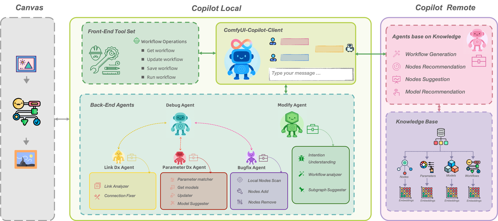
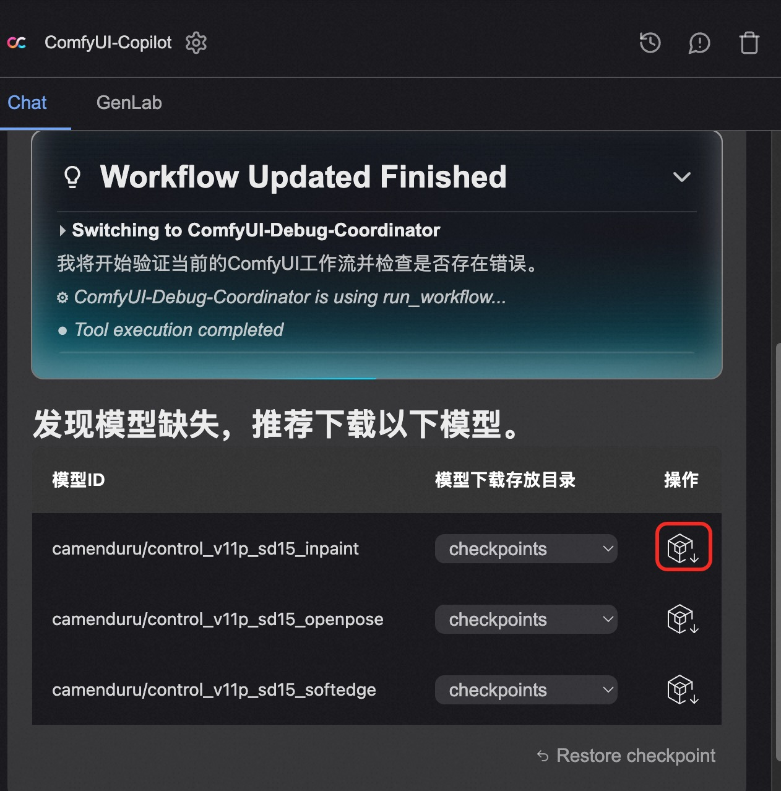
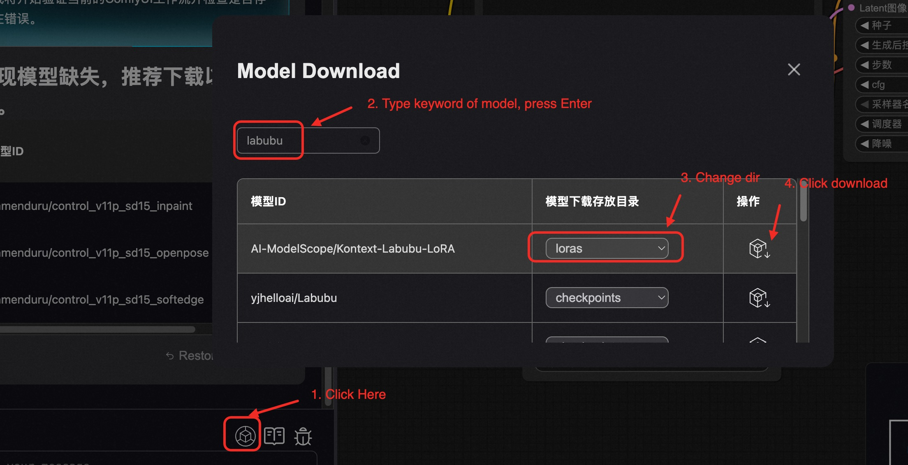
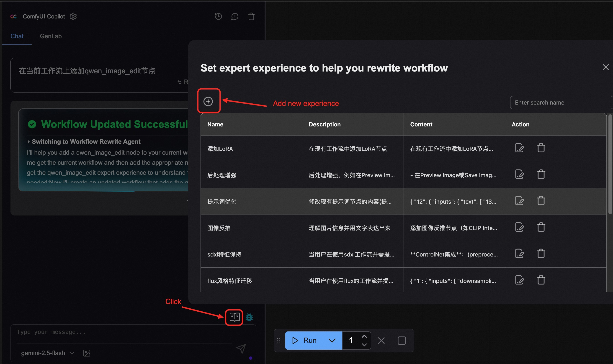
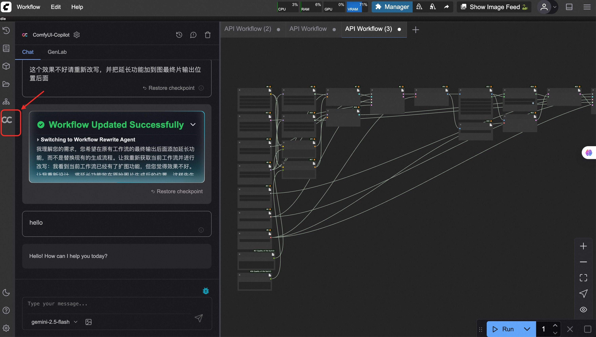
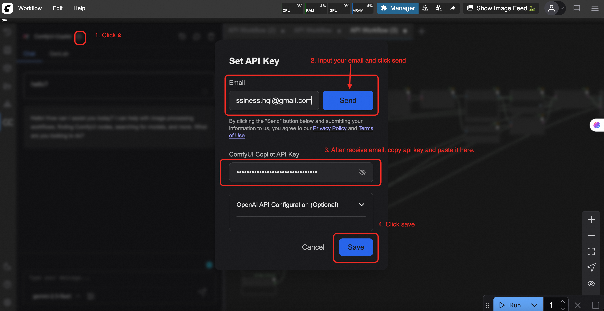

[中文](./README_CN.md) ｜ English

<div align="center">

# 🎯 ComfyUI-Copilot: Your Intelligent Assistant for ComfyUI

<!-- Enhancing Image Generation Development with Smart Assistance -->

<h4 align="center">

<div align="center">
 

  <a href="https://discord.gg/rb36gWG9Se">
    
  </a>    
<a href="https://github.com/AIDC-AI/ComfyUI-Copilot/blob/main/assets/qrcode.png">
    
  </a>        
<a href="https://x.com/Pixelle_AI" target="_blank" rel="noopener">
  
</a>
<a href="https://aclanthology.org/2025.acl-demo.61.pdf">
  
</a>


</h4>


👾 _**Alibaba International Digital Commerce**_ 👾


</div>


https://github.com/user-attachments/assets/4b5806b8-dd34-4219-ac9f-6896115c5600


## ⚠️ Service Update & Adjustment Notice

> **Kindly be informed:** Due to an internal service review and update, the following features will **no longer be available** soon:
>
> - Node information query
> - Job recommendations
> - Workflow generation
>
> **The API service has been suspended.** To continue using Agent-related capabilities, please go to the **Settings page** and enter your own **API Key** and **Base URL**.
>
> All **Agent-related capabilities** remain fully available and are not affected by this change. We apologize for any inconvenience this may cause. Thank you for your understanding.

---

## 🌟 Introduction


**ComfyUI-Copilot** is an AIGC intelligent assistant built on ComfyUI that provides comprehensive support for tedious workflow building, ComfyUI-related questions, parameter optimization and iteration processes! It streamlines the debugging and deployment of AI algorithms, making creative workflows more efficient and effortless.

### 🎉 **Major Update on 2025.08.14：Evolving into a Workflow Development Coworker**

The newly released **ComfyUI-Copilot v2.0** evolves from a "helper tool" into a "development partner"—not just assisting with workflow development, but capable of autonomously completing development tasks.
We now cover the entire workflow lifecycle, including generation, debugging, rewriting, and parameter tuning, aiming to deliver a significantly enhanced creative experience. Key new features include:

- 🔧 **One-Click Debug:**：Automatically detects errors in your workflow, precisely identifies issues, and provides repair suggestions.

- 🔄 **Workflow Rewriting**：Optimizes the current workflow based on your description, such as adjusting parameters, adding nodes, and improving logic.

- 🚀 **Enhanced Workflow Generation**：Understands your requirements more accurately and generates tailored workflows, lowering the barrier to entry for beginners.

- 🧠 **Upgraded Agent Architecture**：Now aware of your local ComfyUI environment, Copilot delivers optimized, personalized solutions.

✨ **Try the brand-new ComfyUI-Copilot v2.0 now and embark on an efficient creative journey!**

<div align="center">

</div>

---
<div id="tutorial-start" />
  
## 🔥 Core Features (V2.0.0)

- 1. 💎 **Generate First Version Workflow**: Based on your text description, we provide workflows that meet your needs, returning 3 high-quality workflows from our library and 1 AI-generated workflow. You can import them into ComfyUI with one click to start generating images.
  - Simply type in the input box: I want a workflow for xxx.

  
- 2. 💎 **Workflow Debug**: Automatically analyze errors in workflows, help you fix parameter errors and workflow connection errors, and provide optimization suggestions.
  - Among the 4 workflows returned above, when you select one and click Accept, it will be imported into the ComfyUI canvas. At this time, you can click the Debug button to start debugging.
  - There is a Debug button in the upper right corner of the input box. Click it to directly debug the workflow on the current canvas.

  - If a missing model is identified, it will automatically prompt you to download the model.
<div align="center">

</div>
  - You can also directly click the Model Download button below, enter the model keyword, and select the required model from the recommended models.


- 3. 💎 **Unsatisfied with Previous Workflow Results?**: Tell us what you're not satisfied with, and let us help you modify the workflow, add nodes, modify parameters, and optimize workflow structure.
  - Type in the input box: Help me add xxx to the current canvas.
  - Note: If the model is new after May 2025, such as wan2.2, it may cause the LLM to fail to understand and the process to interrupt. You can try adding expert experience to help the LLM better generate workflows.
  - The workflow rewrite is difficult, and it carries a lot of context, so you need to control the context length, otherwise it is easy to interrupt. It is recommended to often click the Clear Context button in the upper right corner to control the conversation length.



- 4. 💎 **Parameter Tuning Too Painful?**: We provide parameter tuning tools. You can set parameter ranges, and the system will automatically batch execute different parameter combinations and generate visual comparison results to help you quickly find the optimal parameter configuration.
  - Switch to the GenLab tab and follow the guidance. Note that the workflow must be able to run normally at this time to batch generate and evaluate parameters.


Want ComfyUI-Copilot to assist you in workflow development?
- 5. 💎 **Node Recommendations**: Based on your description, recommend nodes you might need and provide recommendation reasons.
  - Type in the input box: I want a node for xxx.


- 6. 💎 **Node Query System**: Select a node on the canvas, click the node query button to explore the node in depth, view its description, parameter definitions, usage tips, and downstream workflow recommendations.
  - Type in the input box: What's the usage, input and output of node xxx.


- 7. 💎 **Model Recommendations**: Based on your text requirements, Copilot helps you find base models and 'lora'.
  - Type in the input box: I want a Lora that generates xxx images.


- 8. 💎 **Downstream Node Recommendations**: After you select a node on the canvas, based on the existing nodes on your canvas, recommend downstream subgraphs you might need.


---

## 🚀 Getting Started

**Repository Overview**: Visit the [GitHub Repository](https://github.com/AIDC-AI/ComfyUI-Copilot) to access the complete codebase.

#### Installation
  1. Firstly, use git to install ComfyUI-Copilot in the ComfyUI custom_nodes directory:

   ```bash
   cd ComfyUI/custom_nodes
   git clone git@github.com:AIDC-AI/ComfyUI-Copilot.git
   ```
   
   or
   
   ```bash
   cd ComfyUI/custom_nodes
   git clone https://github.com/AIDC-AI/ComfyUI-Copilot
   ```

   Secondely, in the ComfyUI custom_nodes directory, find the ComfyUI-Copilot directory and install ComfyUI-Copilot dependencies

   ```bash
   cd ComfyUI/custom_nodes/ComfyUI-Copilot
   pip install -r requirements.txt
   ```
   If you are a Windows user:

   ```bash
   python_embeded\python.exe -m pip install -r ComfyUI\custom_nodes\ComfyUI-Copilot\requirements.txt
   ```
   

  2. **Using ComfyUI Manager**: Open ComfyUI Manager, click on Custom Nodes Manager, search for ComfyUI-Copilot, and click the install button, remember to update the ComfyUI-Copilot to the latest version.
     - The Manager requires permissions. To prevent errors during execution, it's recommended to run ComfyUI with "sudo python main.py".
     - If you encounter an error during the update, try to delete the folder or click uninstall and then reinstall.
     - If an error occurs during execution, it's recommended to use the bottom panel button in the upper right corner to trigger the Manager to install ComfyUI-Copilot. An error log will appear below. Take a screenshot and post it to your git issue.
     - Using the Manager installation method is prone to bugs, so it's recommended to use the git installation method above.
   
   

#### **Activation**
After running the ComfyUI project, find the Copilot activation button on the left side of the panel to launch its service.


#### **API Key Generation**
Click the * button, enter your email address in the popup window, and the API Key will be automatically sent to your email address later. After receiving the API Key, paste it into the input box, click the save button, and you can activate Copilot.


#### **Config your model(OpenAI/LMStudio/MiniMax)**
Click the * button，config chat model and workflow generate model seperately.
<div align="center">
  

</div>

#### **Using MiniMax as LLM Provider**
[MiniMax](https://www.minimaxi.com/) provides OpenAI-compatible API with powerful models (MiniMax-M2.7, MiniMax-M2.7-highspeed with 1M context window).

**Option 1 — Environment variables** (recommended for permanent setup):
```bash
export MINIMAX_API_KEY="your-minimax-api-key"
# Then start ComfyUI as usual
```

**Option 2 — UI configuration**:
1. Click the settings button in ComfyUI-Copilot
2. Set **Base URL** to `https://api.minimax.io/v1`
3. Enter your MiniMax API key
4. Select a MiniMax model from the dropdown

#### **Note**：
This project is continuously updated. Please update to the latest code to get new features. You can use git pull to get the latest code, or click "Update" in the ComfyUI Manager plugin.

---
<div id="tutorial-end" />

## 🤝 Contributions

We welcome any form of contribution! Feel free to make issues, pull requests, or suggest new features.

---

## 📞 Contact Us

For any queries or suggestions, please feel free to contact: ComfyUI-Copilot@service.alibaba.com.
<div align="center">
   
   
  WeChat

  

  Discord: https://discord.gg/rb36gWG9Se
</div>


## 📚 License

This project is licensed under the MIT License - see the [LICENSE](https://opensource.org/licenses/MIT) file for details.

---
## Star History

[](https://star-history.com/#AIDC-AI/ComfyUI-Copilot&Date)


